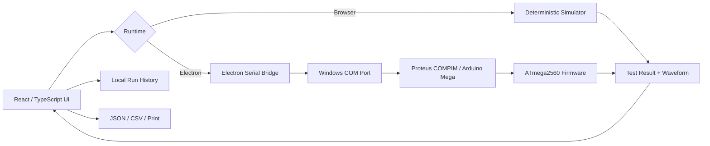

# STOC Energy Meter Test System

> A desktop engineering interface for controlling, simulating, and inspecting Short-Time Over-Current meter tests through React, Electron, serial communication, Proteus, and Arduino Mega.

The **STOC Dashboard** bridges a modern software interface with an embedded test workflow. The same React application can run in a browser against a deterministic simulator or inside Electron with direct Windows serial-port access to Proteus / Arduino hardware.

It was built as an engineering demonstration system: test profiles can be selected, armed, fired, observed as waveforms, recorded locally, and exported for inspection.

> **Engineering boundary:** this repository is a laboratory demonstration, not a calibrated meter-certification instrument. Waveform values are raw 10-bit ADC samples, not measured amperes.

## What it demonstrates

- React + TypeScript engineering dashboard
- Electron bridge for native Windows serial access
- Serial protocol integration with Arduino Mega / ATmega2560 firmware
- Proteus simulation workflow
- Three meter-test profiles: Single Phase, Three Phase Whole Current, and LTCT
- Deterministic simulator for repeatable demos without hardware
- 200-sample waveform capture and visualization
- Run history with operator metadata and notes
- JSON and CSV exports
- Type, test, web-build, and desktop-build verification

## System architecture



## Test workflow

```text
Select profile
    ↓
Arm test
    ↓
Confirm controlled fire
    ↓
Firmware / simulator executes sequence
    ↓
Capture raw waveform
    ↓
Review timeline + result
    ↓
Store or export engineering evidence
```

The interface deliberately separates **arming** from **firing** so an accidental click does not immediately trigger the software sequence.

## Runtime modes

### Browser simulator

The browser version uses a deterministic simulator and requires no serial hardware.

```powershell
npm run dev:web
```

This is the most reliable path for demonstrating the complete UI workflow.

### Electron + serial

Electron provides access to local COM ports for Proteus or Arduino communication.

```powershell
npm run dev:electron
```

The current protocol uses **9600 baud, 8 data bits, no parity, 1 stop bit (9600 8N1)**.

## Proteus workstation setup

For a Windows Proteus environment:

```powershell
npm run setup:proteus
```

The setup script validates the bundled Proteus project and firmware, installs locked dependencies, prepares the expected firmware path, and builds the desktop application.

It does **not** install Proteus, create a virtual COM pair, modify the schematic, or perform electrical validation.

For the full connection procedure, see [`docs/proteus-setup.md`](docs/proteus-setup.md).

## Build commands

### Web

```powershell
npm run build:web
npm exec -- vite preview --host 127.0.0.1
```

### Desktop

```powershell
npm run build:desktop
npm run start:electron
```

### Windows package

```powershell
npm run package:win
```

The repository should currently be treated as a **run-from-source engineering demo** unless the packaged Windows build has been independently re-verified.

## Verification

```powershell
npm test -- --pool=forks --maxWorkers=1
npm run test:types
npm run build:web
npm run build:desktop
git diff --check
```

Release evidence and acceptance checks are documented in [`docs/release-checklist.md`](docs/release-checklist.md).

## Results and evidence

Completed runs can include:

- selected test profile
- meter serial number
- operator name
- run notes
- event timeline
- raw ADC waveform samples
- timestamped local history

Results can be exported as **JSON** or **CSV**, or rendered through the operating-system print flow.

These exports are engineering/demo records only. They are not signed, calibrated, tamper-evident compliance certificates.

## Key engineering constraints

### Raw ADC data

The firmware supplies raw 10-bit ADC values. No validated calibration factor currently converts those samples into certified current measurements, so the UI does not mislabel them as amperes.

### Browser vs native access

Direct serial access is intentionally isolated to Electron. The browser build remains simulator-only instead of relying on inconsistent browser serial support.

### Reproducible demonstration path

The deterministic simulator generates a known 200-sample waveform, allowing the entire state machine, visualization, history, and export flow to be tested without energized equipment.

## Safety boundary

This project controls a **software test sequence**. It must not be treated as a physical safety system.

- Software disconnect is not an emergency stop.
- Do not connect real high-current hardware without qualified electrical validation of the power stage, isolation, protection, interlocks, calibration chain, and emergency-stop mechanism.
- Keep serial access local to the controlled test computer.
- Do not expose the application as a remotely reachable firing service.
- Do not store credentials or personal secrets in run notes or source files.

See [`docs/limitations.md`](docs/limitations.md) before hardware use.

---

This project sits at the boundary between **frontend software, desktop systems, serial protocols, embedded firmware, and electrical simulation**—the part that made it interesting to build.